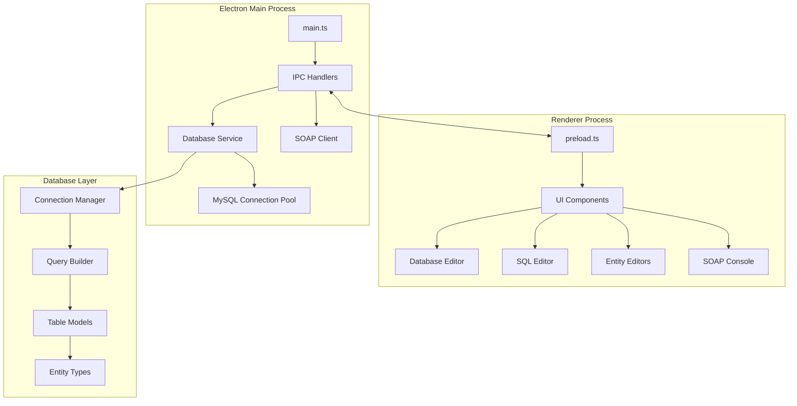
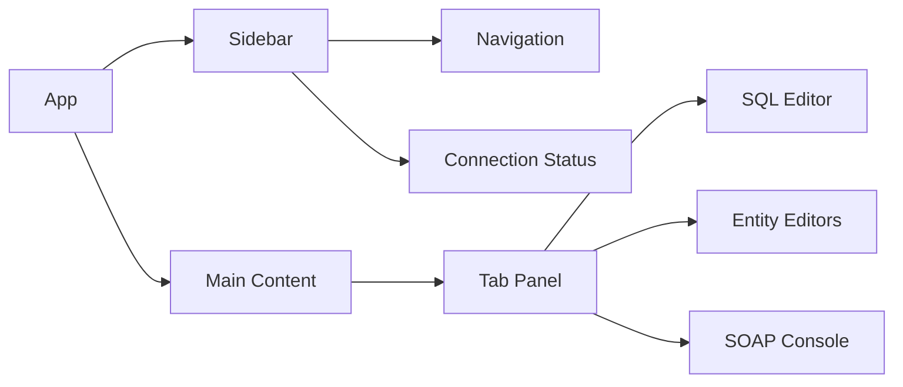
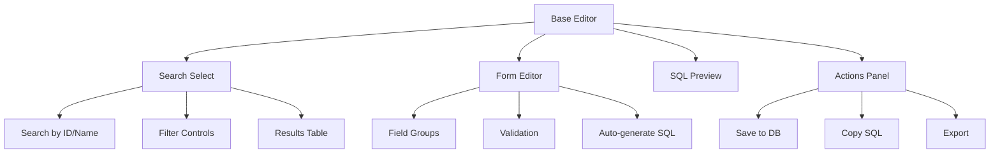

# WoW Admin Database Editor Implementation Plan

## Overview

This plan outlines the implementation of database editing capabilities similar to [Keira3](https://github.com/azerothcore/Keira3) for the WoW Admin application. The implementation will include a full database editor with MySQL connectivity, SQL query editor, and entity editors for AzerothCore database tables.

## Technology Stack

| Component | Current | Target |
|-----------|---------|--------|
| Language | JavaScript | TypeScript |
| Styling | Custom CSS | Tailwind CSS |
| Database | None | MySQL (mysql2) |
| Build | electron-builder | electron-builder + esbuild |

## Architecture Overview



## Phase 1: TypeScript Migration

### 1.1 Project Configuration

- [ ] Add TypeScript dependencies: `typescript`, `@types/node`, `@types/electron`
- [ ] Create `tsconfig.json` with strict mode enabled
- [ ] Configure esbuild for TypeScript compilation
- [ ] Update package.json scripts for TypeScript build pipeline
- [ ] Add type declarations for Electron IPC

### 1.2 Source File Migration

- [ ] Convert `src/main.js` to `src/main.ts`
- [ ] Convert `src/preload.js` to `src/preload.ts`
- [ ] Convert `src/soap-client.js` to `src/soap-client.ts`
- [ ] Convert `src/config-store.js` to `src/config-store.ts`
- [ ] Create type definitions for IPC channels

### 1.3 Renderer Migration

- [ ] Convert `renderer/app.js` to TypeScript modules
- [ ] Create type-safe IPC client wrapper
- [ ] Add type definitions for UI state

## Phase 2: Database Layer Implementation

### 2.1 Core Database Service

```typescript
// src/database/db-service.ts
interface DbConfig {
  host: string;
  port: number;
  username: string;
  password: string;
  database: string;
}

interface QueryResult<T> {
  result: T[];
  fields: FieldInfo[];
  affectedRows?: number;
  insertId?: number;
}

class DatabaseService {
  // Connection management
  connect(config: DbConfig): Promise<void>;
  disconnect(): Promise<void>;
  testConnection(): Promise<boolean>;
  
  // Query execution
  query<T>(sql: string, params?: any[]): Promise<QueryResult<T>>;
  execute(sql: string, params?: any[]): Promise<QueryResult<any>>;
  
  // Transaction support
  beginTransaction(): Promise<void>;
  commit(): Promise<void>;
  rollback(): Promise<void>;
}
```

### 2.2 Connection Management

- [ ] Implement MySQL connection pool using `mysql2/promise`
- [ ] Add connection state tracking and reconnection logic
- [ ] Store database credentials securely in electron-store
- [ ] Support multiple database profiles (auth, characters, world)

### 2.3 AzerothCore Database Schema Types

```typescript
// src/database/types/creature.ts
interface CreatureTemplate {
  entry: number;
  name: string;
  subname: string | null;
  minlevel: number;
  maxlevel: number;
  faction: number;
  // ... full schema
}

// src/database/types/item.ts
interface ItemTemplate {
  entry: number;
  name: string;
  quality: number;
  // ... full schema
}

// Additional types for:
// - QuestTemplate
// - GameObjectTemplate
// - SmartScripts
// - Conditions
// - SpellTemplate
// - Trainer
// - Gossip
// - Loot tables
```

### 2.4 Query Builder Utilities

- [ ] Create helper functions for common query patterns
- [ ] Implement safe SQL escaping and parameterization
- [ ] Add pagination support for large result sets
- [ ] Create WHERE clause builders for complex filters

## Phase 3: UI Framework Setup with Tailwind CSS

### 3.1 Tailwind Configuration

- [ ] Install Tailwind CSS and PostCSS
- [ ] Create `tailwind.config.js` with custom theme
- [ ] Set up PostCSS build pipeline
- [ ] Create base component styles

### 3.2 Component Architecture



### 3.3 Core UI Components

- [ ] **Connection Panel** - Database connection form with profile management
- [ ] **Sidebar Navigation** - Tree view of database tables and editors
- [ ] **Data Table** - Sortable, filterable table with pagination
- [ ] **Form Editor** - Dynamic form generation based on table schema
- [ ] **SQL Editor** - Syntax-highlighted query editor
- [ ] **Modal Dialogs** - Confirmations, alerts, and forms

### 3.4 State Management

- [ ] Create centralized state store for application data
- [ ] Implement reactive UI updates
- [ ] Add undo/redo support for edits

## Phase 4: SQL Query Editor

### 4.1 Editor Features

- [ ] SQL syntax highlighting (integrate CodeMirror or Monaco)
- [ ] Query history with local storage
- [ ] Multiple query tabs
- [ ] Query execution with result display
- [ ] Export results to CSV/JSON

### 4.2 Safety Features

- [ ] Warning for destructive operations (DROP, DELETE, TRUNCATE)
- [ ] Query validation before execution
- [ ] Transaction mode for bulk operations
- [ ] Read-only mode option

### 4.3 Helper Features

- [ ] Table schema browser
- [ ] Auto-complete for table/column names
- [ ] Query templates for common operations
- [ ] Format SQL button

## Phase 5: Entity Editors Implementation

### 5.1 Editor Architecture



### 5.2 Entity Editors to Implement

| Editor | Database Tables | Priority |
|--------|-----------------|----------|
| Creature Editor | creature_template, creature | High |
| Item Editor | item_template | High |
| Quest Editor | quest_template | High |
| GameObject Editor | gameobject_template, gameobject | Medium |
| Smart Scripts Editor | smart_scripts | High |
| Conditions Editor | conditions | Medium |
| Spell Editor | spell_dbc (custom) | Medium |
| Trainer Editor | trainer, trainer_spell | Medium |
| Gossip Editor | gossip_menu, gossip_menu_option | Medium |
| Loot Editor | creature_loot_template, etc. | Medium |
| Texts Editor | npc_text, page_text | Low |
| Game Tele Editor | game_tele | Low |

### 5.3 Editor Features

Each editor should include:

- [ ] **Search Panel** - Find entities by ID, name, or custom filters
- [ ] **Edit Form** - Organized fields with proper labels and validation
- [ ] **SQL Preview** - Show generated SQL queries in real-time
- [ ] **Diff View** - Show changes compared to original values
- [ ] **Bulk Operations** - Edit multiple records at once
- [ ] **Import/Export** - JSON/SQL import and export

### 5.4 Field Types and Widgets

- [ ] Text input with validation
- [ ] Number input with min/max
- [ ] Dropdown selects for enums
- [ ] Multi-select for flags
- [ ] Color picker for display colors
- [ ] Reference selectors (link to other tables)
- [ ] Rich text areas for long text

## Phase 6: Testing and Documentation

### 6.1 Testing

- [ ] Unit tests for database service
- [ ] Integration tests for IPC handlers
- [ ] UI component tests
- [ ] End-to-end tests for critical workflows

### 6.2 Documentation

- [ ] Update README with new features
- [ ] Document database connection setup
- [ ] Create user guide for each editor
- [ ] Add inline code documentation

## File Structure

```
wow-admin/
├── src/
│   ├── main.ts                 # Electron main process
│   ├── preload.ts              # Context bridge
│   ├── database/
│   │   ├── db-service.ts       # MySQL connection service
│   │   ├── query-builder.ts    # SQL query helpers
│   │   ├── types/
│   │   │   ├── index.ts
│   │   │   ├── creature.ts
│   │   │   ├── item.ts
│   │   │   ├── quest.ts
│   │   │   └── ...             # Other entity types
│   │   └── constants/
│   │       ├── tables.ts       # Table definitions
│   │       └── enums.ts        # Enum values from AC
│   ├── soap/
│   │   └── soap-client.ts      # Existing SOAP client
│   ├── config/
│   │   └── config-store.ts     # Settings management
│   └── ipc/
│       ├── handlers.ts         # IPC channel handlers
│       └── channels.ts         # Channel definitions
├── renderer/
│   ├── index.html
│   ├── styles/
│   │   └── main.css            # Tailwind imports
│   ├── scripts/
│   │   ├── app.ts              # Main application
│   │   ├── components/
│   │   │   ├── connection.ts
│   │   │   ├── sidebar.ts
│   │   │   ├── data-table.ts
│   │   │   └── ...
│   │   ├── editors/
│   │   │   ├── base-editor.ts
│   │   │   ├── creature-editor.ts
│   │   │   ├── item-editor.ts
│   │   │   └── ...
│   │   └── utils/
│   │       ├── ipc.ts          # Type-safe IPC client
│   │       └── state.ts        # State management
│   └── assets/
├── package.json
├── tsconfig.json
├── tailwind.config.js
└── esbuild.config.js
```

## Dependencies to Add

```json
{
  "dependencies": {
    "mysql2": "^3.6.0",
    "electron-store": "^8.1.0"
  },
  "devDependencies": {
    "typescript": "^5.3.0",
    "@types/node": "^20.10.0",
    "@types/electron": "^28.0.0",
    "tailwindcss": "^3.4.0",
    "postcss": "^8.4.0",
    "autoprefixer": "^10.4.0",
    "esbuild": "^0.19.0"
  }
}
```

## IPC Channels

| Channel | Direction | Description |
|---------|-----------|-------------|
| `db:connect` | Renderer → Main | Connect to database |
| `db:disconnect` | Renderer → Main | Disconnect from database |
| `db:testConnection` | Renderer → Main | Test connection |
| `db:query` | Renderer → Main | Execute SELECT query |
| `db:execute` | Renderer → Main | Execute INSERT/UPDATE/DELETE |
| `db:getTables` | Renderer → Main | Get list of tables |
| `db:getSchema` | Renderer → Main | Get table schema |
| `db:beginTransaction` | Renderer → Main | Start transaction |
| `db:commit` | Renderer → Main | Commit transaction |
| `db:rollback` | Renderer → Main | Rollback transaction |

## Security Considerations

1. **Credential Storage** - Use electron-store with encryption for passwords
2. **SQL Injection Prevention** - Always use parameterized queries
3. **Connection Isolation** - Each connection uses credentials provided by user
4. **Read-only Mode** - Option to connect with read-only permissions
5. **Query Validation** - Warn before executing destructive operations

## Implementation Order

1. **Phase 1** - TypeScript migration (foundation for type safety)
2. **Phase 2** - Database layer (core functionality)
3. **Phase 3** - UI framework (improved developer experience)
4. **Phase 4** - SQL editor (immediate value, simpler to implement)
5. **Phase 5** - Entity editors (incremental, add editors one by one)
6. **Phase 6** - Testing and documentation (ongoing)

## Success Criteria

- [ ] Can connect to AzerothCore MySQL databases
- [ ] Can execute raw SQL queries with results display
- [ ] Can browse and edit creature_template records
- [ ] Can browse and edit item_template records
- [ ] Can browse and edit quest_template records
- [ ] Generated SQL can be copied or executed directly
- [ ] All existing SOAP functionality remains working
- [ ] Application builds and runs on Windows, macOS, and Linux
